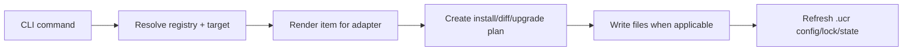

# Architecture

UCR is split into three workspace packages plus registry fixtures and checked-in example targets.

## Workspace Layout

| Location | Responsibility |
| --- | --- |
| `packages/cli` | CLI argument parsing, help text, and command dispatch |
| `packages/core` | adapter inspection, input resolution, rendering, install planning, diff, and upgrade |
| `packages/schema` | registry types, validation logic, and the JSON schema file |
| `fixtures/registries/ucr-official` | official registry fixture and owned templates |
| `examples/*` | canonical install targets used for docs and validation |

## Package Responsibilities

### `@ucr/cli`

The CLI package is intentionally thin:

- parses the command line in `src/bin.ts`
- prints help text
- dispatches to `init`, `list`, `show`, `add`, `diff`, and `upgrade`
- resolves registry options through `src/context.ts`

It does not contain install logic. It translates user input into calls into `@ucr/core`.

### `@ucr/core`

The core package holds the behavior that matters for UCR itself:

- adapter detection and path mapping
- project config read/write
- registry item resolution
- typed input resolution
- template rendering
- install planning and application
- diff classification
- upgrade planning and three-way merge
- lock and state persistence

High-level flow:

### `@ucr/schema`

The schema package defines:

- registry document types
- enum-like value constraints for kinds, targets, surfaces, and input types
- validation rules used when loading registry documents
- the shipped `registry.schema.json`

This keeps the registry contract centralized and reusable across the rest of the repo.

## Fixture Registry

The official fixture registry lives in `fixtures/registries/ucr-official/registry.json`, with templates under `fixtures/registries/ucr-official/templates/...`.

That fixture is important because:

- it is the catalog used throughout the docs
- it exercises both supported adapters
- it contains both reusable items and instance-scoped blocks
- it acts as the default upward-discovered registry in repo-local workflows

## Examples As Executable Documentation

The checked-in examples are not synthetic samples. They are real UCR targets with generated source and tracked `.ucr` state checked in. That gives contributors a stable place to verify:

- adapter-specific output roots
- capability dependencies
- diff and upgrade behavior
- docs command examples

## Upgrade Pipeline In Repo Terms

The upgrade path depends on a few concrete modules:

- `project-config.ts` for project shape
- `render.ts` for adapter-aware output generation
- `lock.ts` for install ownership and inputs
- `state.ts` for upstream snapshots
- `diff.ts` and `upgrade.ts` for comparison and application logic

If you need to understand why `upgrade` classified a file a certain way, those are the primary files to read.
